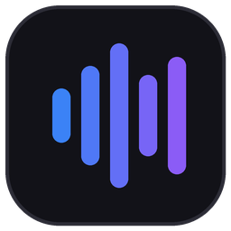
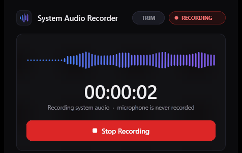
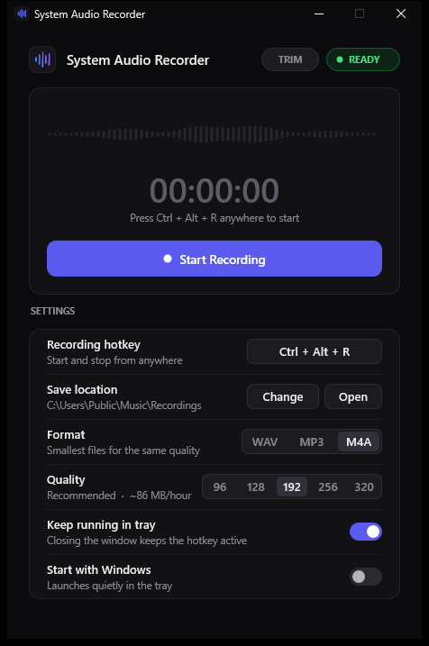
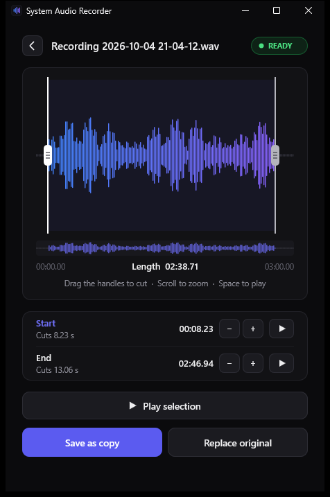
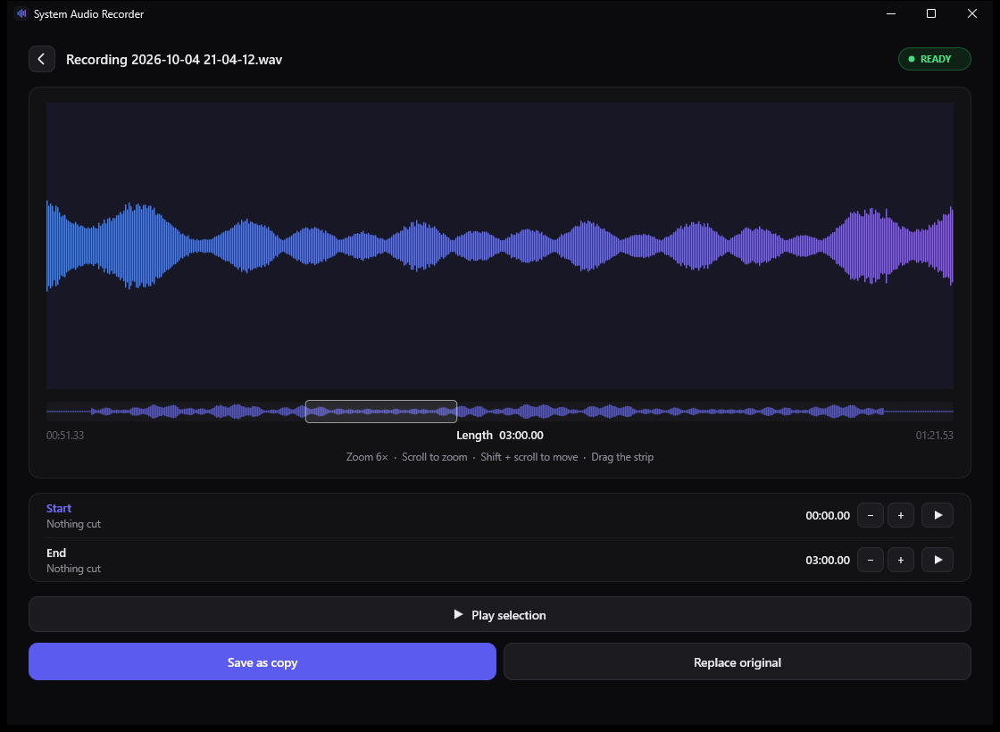

<div align="center">



# System Audio Recorder

**Record what your PC plays. Never your microphone.**<br>
One hotkey to start, the same hotkey to stop. Tiny, native and free.

[](https://github.com/oncexhub/system-audio-recorder/releases/latest/download/SystemAudioRecorder.exe)


<br>



</div>

## Features

- 🎧 **System audio only.** Records exactly what you hear (browser, Spotify, games, Discord), never the microphone.
- ⌨️ **One global hotkey.** `Ctrl + Alt + R` starts and stops from anywhere, even in a game. You can change it.
- ✂️ **Built-in trimming.** Cut off a late start or an early stop, with no quality loss. Zoom in to cut to a hundredth of a second.
- ↔️ **Resizable.** Make the window as big as you like. The waveforms grow with it, and the app remembers the size.
- 🎚️ **WAV, MP3 or M4A.** Choose 96–320 kbps for MP3 and M4A. The default is 192 kbps.
- ⏱️ **Long recordings.** No length limit, and files stay playable even after a crash.
- 🪶 **Tiny and light.** About 0.5 MB, no installer, about 1% CPU. Runs quietly in the tray.

## Screenshots

<div align="center">
<table>
<tr>
<td align="center"><br><sub><b>Ready to record</b></sub></td>
<td align="center"><br><sub><b>Trim the start and end</b></sub></td>
</tr>
</table>
</div>

## Download

1. **[Download `SystemAudioRecorder.exe`](https://github.com/oncexhub/system-audio-recorder/releases/latest/download/SystemAudioRecorder.exe)**. You can also get `SAR-windows.zip` from the [Releases](../../releases/latest) page.
2. Put it anywhere you like and double-click it. You don't need to install anything.
3. On first start, the app asks once whether to add a **SAR** shortcut to your desktop and Start menu.

> [!NOTE]
> The green **Code → Download ZIP** button only contains the source code, not the app.

> [!TIP]
> **"Windows protected your PC"?** The app isn't signed with a paid certificate, so SmartScreen may warn the first time. Click **More info → Run anyway**. You only need to do this once.

**Requirements:** Windows 10 or 11 (64-bit). You don't need Rust or any other runtime.

## How to use

| | |
|---|---|
| **Record** | Press `Ctrl + Alt + R` anywhere. Press it again to stop. The file is saved automatically. |
| **Find your files** | `Music\Recordings`, named `Recording YYYY-MM-DD HH-MM-SS`. Click **Open** in the app. |
| **Change the hotkey** | Click the hotkey in the app and press a new combination. Press Esc to cancel. |
| **Tray** | Closing the window keeps the app in the tray. The icon turns red while recording. Right-click it for options or **Exit**. |

The app records whatever device Windows is playing through: speakers, headphones and so on. If you switch devices mid-recording, it simply carries on.

## Trimming

Started a little too early or stopped too late? Cut it off:

1. Click **Trim** after a recording, or click **TRIM** at the top and pick a file. You can also drag a `.wav`, `.mp3` or `.m4a` onto the window.
2. Drag the two handles. Fine-tune with **− / +** or the arrow keys: 0.1 s, 1 s with Shift, or 0.01 s with Ctrl.
   - **Scroll** over the waveform to zoom in where your mouse is, and **Shift + scroll** to move sideways.
   - The strip under the waveform shows the whole file. Drag the white frame to jump around, and press `0` to zoom out fully.
   - Make the window bigger, or maximize it, for an even more detailed waveform.
3. Press **▶** to check the start or the end, and Space to play the selection.
4. Click **Save as copy** to keep the original, or **Replace original** to overwrite it (the app asks first).

Cutting never re-encodes, so quality stays identical and even hours-long recordings save in seconds.

<div align="center">
<br>
<sub><b>Zoomed in on a large window: the frame in the strip shows which part you're looking at</b></sub>
</div>

## Formats

| Format | Quality | Size per hour |
|---|---|---|
| **WAV** (default) | Lossless, 48 kHz / 16-bit stereo | ~690 MB |
| **MP3** | 96 / 128 / **192** / 256 / 320 kbps | ~43–144 MB |
| **M4A** (AAC) | 96 / 128 / **192** / 256 / 320 kbps | ~43–144 MB |

At the same bitrate, M4A usually sounds a bit better than MP3. 192 kbps (~86 MB per hour) is a good balance for both.

## Settings and uninstalling

Settings are stored in `%APPDATA%\SystemAudioRecorder\settings.ini`. To remove the app:
1. Turn off **Start with Windows** in the app, if you turned it on.
2. Exit the app from the tray.
3. Delete the `.exe`, the SAR shortcuts and the settings folder.

<details>
<summary><b>How it works</b></summary>

- WASAPI **loopback** on the default playback device captures exactly what you hear.
- A silent playback stream keeps the audio engine running, so silences stay in the recording and its length is exact.
- Audio is streamed straight to disk. WAV headers are refreshed every few seconds, and files over 4 GB become RF64.
- MP3 and AAC encoding use the encoders built into Windows (Media Foundation). M4A is recorded as an AAC stream (playable even after a crash) and wrapped into an .m4a when you stop, without re-encoding.
- The UI is drawn with Direct2D, which is also built into Windows. There is no web engine and no framework.

</details>

<details>
<summary><b>Building from source</b></summary>

Only needed if you want to change the code. Install [Rust](https://rustup.rs) and the Visual Studio Build Tools ("Desktop development with C++"), then run:

```
cargo build --release
```

The output is `target\release\SystemAudioRecorder.exe`. Pushing a tag such as `v1.2.0` makes GitHub Actions build the exe and the zip and publish them as a release.

</details>

## License

[MIT](LICENSE)
